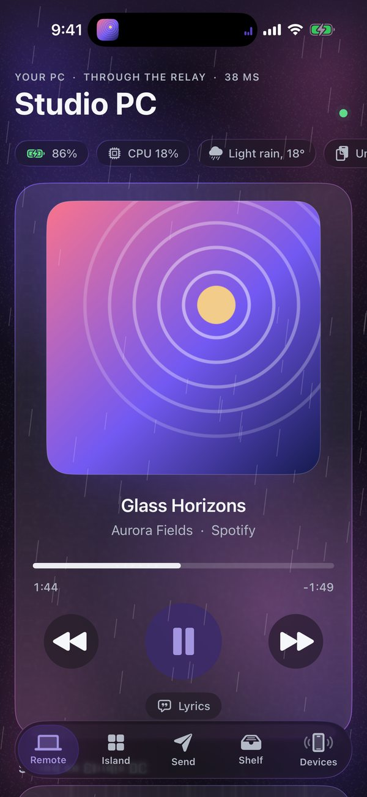
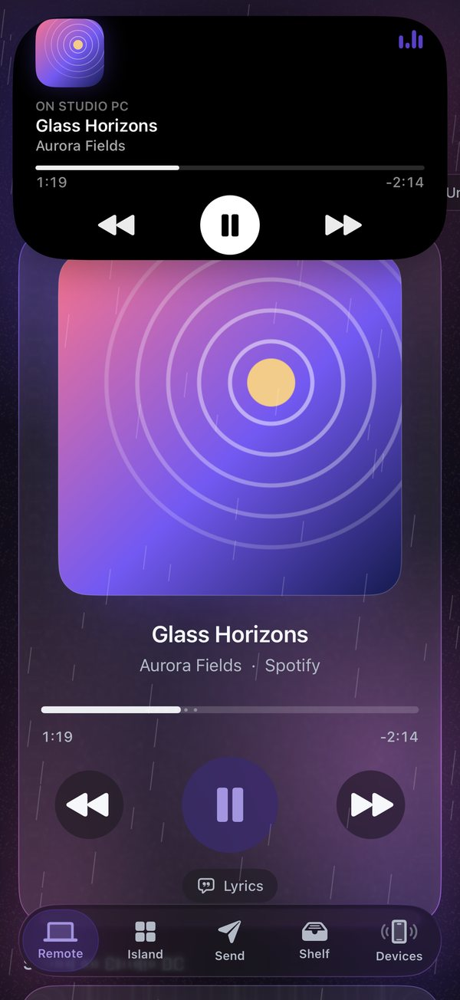
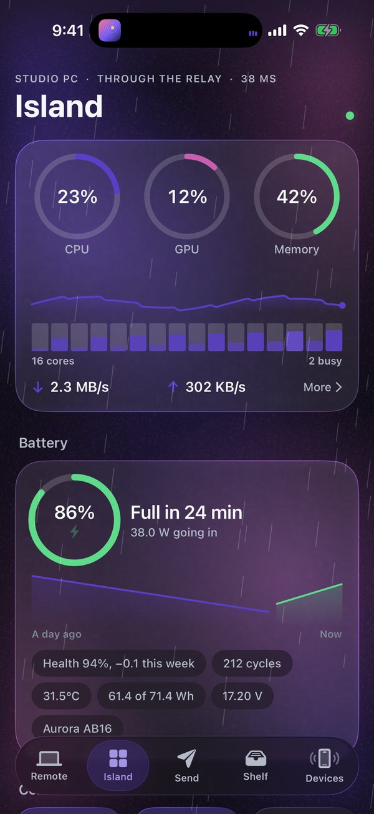
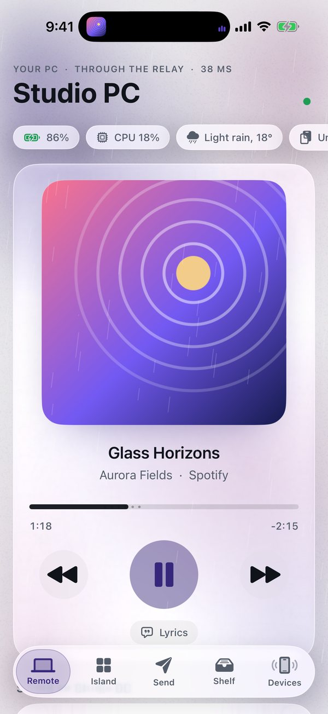

# Arnav Island for iPhone

The companion app for **Arnav Island**, the Dynamic Island for Windows. It's the Android app, rebuilt for the iPhone in Swift and SwiftUI, with everything the iPhone adds on top.

It talks to your PC with the island's own protocol, byte for byte, and is tested live against the island's engine on every build:
- ECDH P-256 pairing
- AES-256-GCM sealing
- the free MQTT relays, or straight over your Wi-Fi

<p align="center">
  
  
  
  
</p>

**[Download ArnavIsland.ipa](https://github.com/Arnav-Dugad/arnav-island-ios/releases/latest)**: install it free with AltStore. The step-by-step guide is [below](#put-it-on-an-iphone-for-free).

## What it does

**Your PC, in your hand**
- What plays on your PC, with its cover. The cover leans as you tilt the iPhone and flips over to show the lyrics word by word.
- Play, pause, skip and scrub.
- The volume on a dial that ticks as you turn it.
- Its clipboard both ways; lock it; make it chime (Find my PC).

**The whole island**
- The PC's numbers live on Swift Charts graphs you can scrub, a bar for each processor core, and its battery over the last day.
- Wi-Fi, Bluetooth, dark mode and brightness.
- The focus clock, which also runs in your Dynamic Island.
- The island's command bar, power controls, where its sound plays, and every one of the island's settings.

**Send anything**
- Photos and videos at full quality (HEIC can go as JPEG), files and folders of any size, and documents scanned into a PDF.
- The Shelf: take anything from your PC's Shelf with a tap.
- The share sheet in any app: your PCs show as AirDrop-style bubbles, with a progress ring on each.

**Its screen, here**
- Your PC's screen, live and hardware-decoded. Touch it like a touchscreen and pinch to zoom.
- Picture in Picture, so it stays on top of your other apps.
- Or show this iPhone's camera in a window on the PC.

**Trackpad and keyboard**
- One finger moves the pointer, two scroll, and a double-tap-and-hold drags.
- Typing goes straight to the PC; a keyboard paired to the iPhone works too.

**Handing over**
- A song on your PC continues here from the same second, with Lock Screen controls, AirPods and AirPlay. Hand it back with one tap.
- A page from Safari opens on your PC where you had scrolled to, and the other way round too.

**iPhone only**
- The app's island grows out of the iPhone's own Dynamic Island.
- Live Activities for music, transfers and the focus clock.
- Home and Lock Screen widgets, and Control Center controls.
- Siri and Shortcuts ("Lock my PC with Arnav Island"), the Action button, and Spotlight.
- Face ID lock, with a key kept in the Secure Enclave.
- Liquid Glass on iOS 26.

## Put it on an iPhone, for free

Apple only lets the App Store install apps directly. Anyone can still install an app on their own iPhone for free with a free Apple ID, using **AltStore** (or **SideStore**). The catch with a free Apple ID: the app has to be **refreshed every 7 days**. AltStore does this for you automatically.

You need:
- The iPhone (iOS 18 or later; iOS 26 for Liquid Glass) and its cable.
- A Windows PC or a Mac on the same Wi-Fi.
- An Apple ID. The iPhone owner's own one works; a spare free one works too.

### Step by step (Windows PC + AltStore)

1. **On the PC, install Apple's iTunes and iCloud from Apple's website** (not from the Microsoft Store):
   - iTunes: https://www.apple.com/itunes/download/win64
   - iCloud: https://support.apple.com/en-us/103232

   Open iCloud once and sign in with any Apple ID. AltServer needs both installed.
2. **Download AltServer for Windows** from https://altstore.io, then unzip and install it. Run **AltServer**: a diamond icon appears in the tray by the clock.
3. **Plug the iPhone into the PC.** On the iPhone, tap **Trust** and enter its passcode.
   - Open iTunes, click the phone icon, tick **Sync with this iPhone over Wi-Fi**, then click **Apply**.
   - After that the weekly refresh works without the cable.
4. **Install AltStore on the iPhone.** Click the AltServer tray icon › **Install AltStore** › pick the iPhone, then enter the Apple ID and password.
   - They go only to Apple.
   - If the Apple ID has two-factor authentication, enter the code it shows.
5. **Trust the app and turn on Developer Mode, on the iPhone:**
   1. Settings › General › **VPN & Device Management** › tap the Apple ID › **Trust**.
   2. Settings › Privacy & Security › **Developer Mode** › on › **Restart**. After the restart, tap **Turn On**.
6. **Get Arnav Island.** On the iPhone, open Safari and go to **https://github.com/Arnav-Dugad/arnav-island-ios/releases/latest**. Tap **ArnavIsland.ipa**, then **Download**.
7. **Install it.** Open **AltStore** › **My Apps** › **+** (top left) › **Downloads** › **ArnavIsland.ipa**. AltStore signs it with the Apple ID and installs it (this takes about a minute).
8. **Pair it with your PC.**
   1. On the PC, open Arnav Island's Settings › Privacy & productivity. Turn on **Share with my PCs** and **Reach my PCs anywhere**.
   2. Open the island's Shelf › **Nearby** › **Pair with a code**.
   3. On the iPhone, point the **Camera app** at the QR code the island shows, then tap **Open in Arnav Island**. Or open the app and tap **Pair with your PC**.
   4. Check that both screens show the same six digits, then tap **Pair**.
9. **Refreshing.** AltStore refreshes the app by itself whenever the iPhone and the PC running AltServer share a Wi-Fi network. Keep AltServer running on the PC; it starts with Windows if you tick that option in its menu.
   - If you get "This app is no longer available", open AltStore › My Apps › **Refresh All** while you're on that Wi-Fi.
   - Or plug the iPhone in and refresh.

**Updates.** In AltStore, open **Sources** › **+**, then add `https://raw.githubusercontent.com/Arnav-Dugad/arnav-island-ios/main/altstore/source.json`. New versions then appear in AltStore, one tap to update. You can also download the new .ipa and install it again: your pairing and settings stay.

### No computer after the first time: SideStore

SideStore is a version of AltStore that refreshes on the iPhone itself, so after the first setup you don't need a computer. The setup is longer: a one-time pairing file made with a computer, plus a small VPN app on the iPhone that SideStore uses to sign on its own. Follow the current guide at https://docs.sidestore.io, then install `ArnavIsland.ipa` from Safari the same way as in step 7.

### Good to know

- **A free Apple ID allows 3 sideloaded apps** at once (AltStore counts as one).
  - Arnav Island uses **3 App IDs** of the 10 a free account may register each week: the app, its widgets and its share sheet.
- **Nothing is paid, and no data goes to anyone but your own devices.** AltStore signs with your own Apple ID; the app talks only to your paired PCs.
- **Background:** iOS pauses apps in the background.
  - For your PC to ring the iPhone or send files while the app is closed, turn on **Devices › Stay reachable**. It keeps a silent sound playing that mixes with your music.
  - Live Activities, widgets and Siri work either way.
- **Local network:** the first time, iOS asks to find devices on your network. Allow it for straight-over-Wi-Fi speed; the relay works either way.

## Building it

There's no Mac needed: GitHub Actions builds it on a macOS runner (Xcode 26) with [XcodeGen](https://github.com/yonaskolb/XcodeGen).

Each run does four things:
- It runs the protocol's tests, including a live pairing with the island's own engine when a code is given.
- It builds the app unsigned.
- It packs it as `ArnavIsland.ipa`.
- It screenshots every screen in the simulator.

A `v*` tag publishes the IPA on the release.

```
xcodegen generate
xcodebuild -scheme ArnavIsland -sdk iphoneos -configuration Release CODE_SIGNING_ALLOWED=NO build
scripts/package.sh build/.../ArnavIsland.app ArnavIsland.ipa
```

The layout:
- `Packages/IslandKit` is the protocol, portable Swift with no UI.
- `App` holds the app itself.
- `Widgets` holds the widgets, Live Activities and controls.
- `Share` is the share sheet.
- `Shared` is what the app and the extensions have in common.

## Licence

MIT. See [LICENSE](LICENSE).
